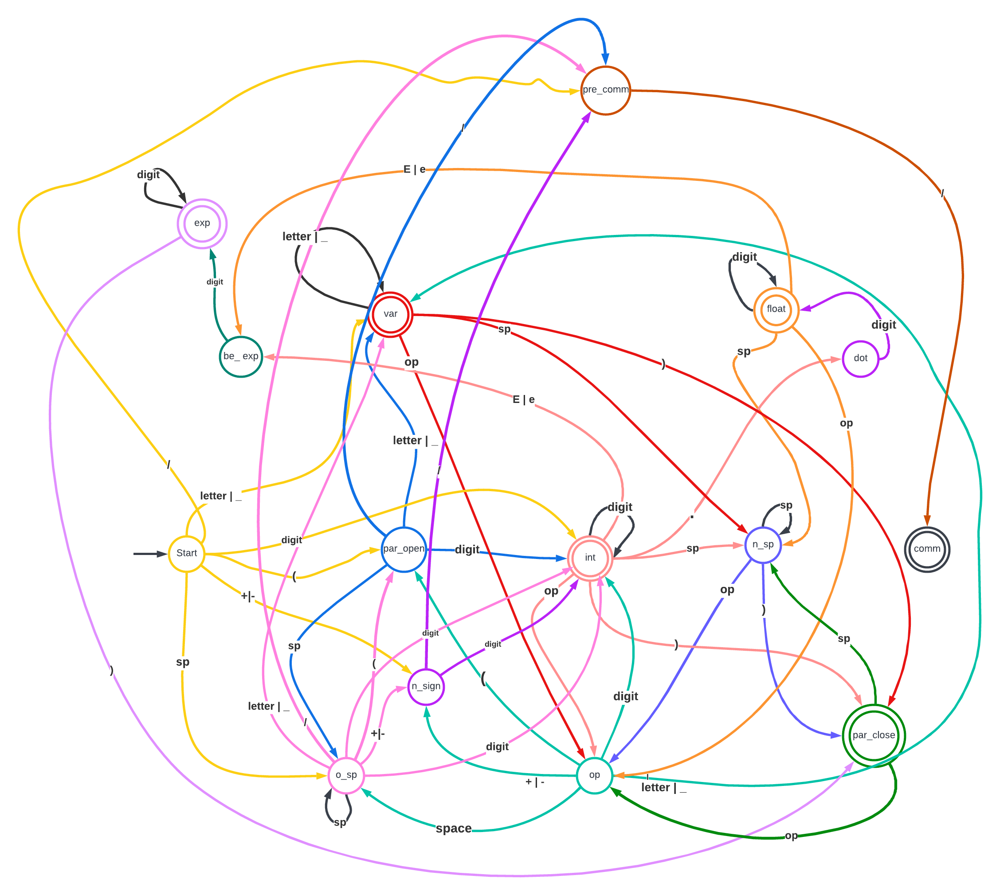

# **Programando un DFA**

#### Miguel Bustamante A01781583
#### Ivan Diaz A01365801
#### Emiliano Sibaja A01025139

# Manual de Usuario
## Como inicializar el programa.

Para correr el programa lo único que debe de hacer el usuario es dentro de su editor de código ya sea "Dr Racket" o "Visual Studio Code" darle run desde la terminal o bien desde el "code runner", con esto ejecutará por su propia cuenta todos los casos de prueba necesarios para que se puedan ver las distintas características del autómata. 

## Lenguaje de programacion usado
El lenguaje de programación usado fue "Racket".
## Instalacion de Racket

Para usuarios de windows se recomienda instalar "DrRacket" directamente de la pagina web de Racket (https://racket-lang.org/download/).

Para evitar estrés inecesario, tambien se recomienda actualizar el ambiente variable del "PATH" de su sistema para incluir el directoria donde se encuentre la aplicacion de racket.

En **Mac OS** y en **Linux** el "PATH" será algo como "/path/to/racket/bin". En **Windows** el "PATH" será algo como "C:\Program Files\Racket".

# Tabla de trasición de un Autómata Finito Determínistico
